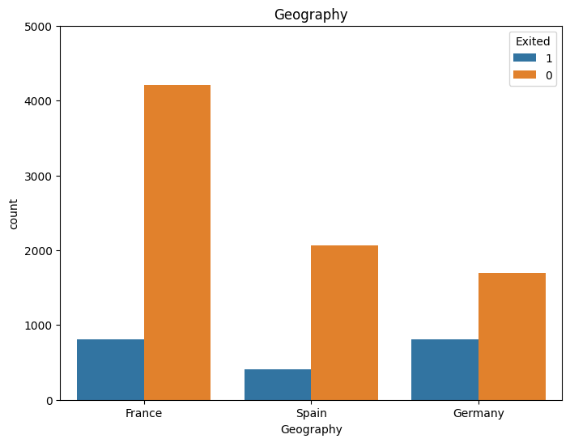
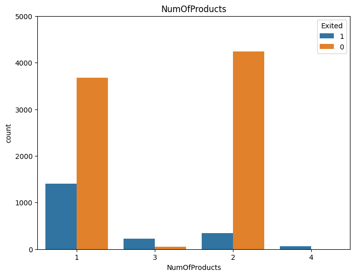
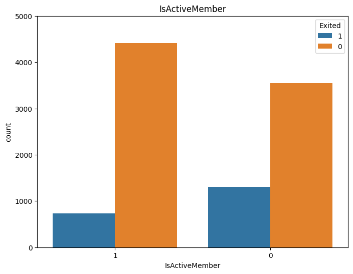
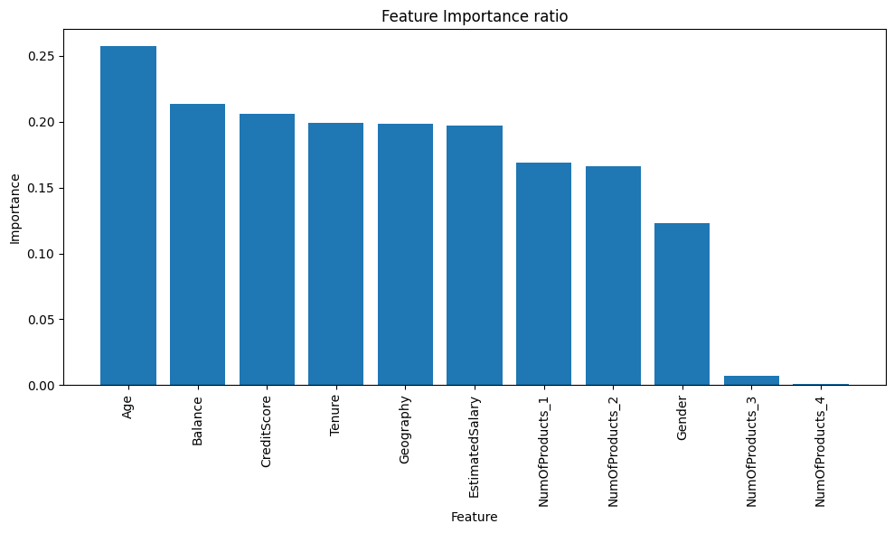

# Modélisation du phénomène de churn d'une banque

# Introduction

Dans cette étude nous allons travailler sur un problème de classification dans lequel nous avons un ensemble de données dans lequel se trouvent les détails des clients d'une banque et la variable cible est une variable binaire reflétant le fait que le client ait quitté la banque (fermé son compte) ou il continue d'être client. Pour ce faire, nous allons dans un premier temps faire une étude exploratoire de la base des données enfin de determiner l'ensemble  des caractéristiques de notre donnée. Dans la deuxième partie nous allons metre en place quatre méthodes SVM afin de modéliser le phénomène de churn pour après choisir le meilleur en utilisant un certain nombre de critère de mesure. La dernière étape sera consacré à l'implémentation d'une méthode ANN pour modéliser le phenomène de churn et enfin nous allons terminé par une conclusion.

# Analyse descriptive

L'analyse exploratoire est une étape nécessaire et importante dans toute étude statistique. En effet, elle nous permet d'apprenhender, de comprendre les données que nous avons à notre disposition pour l'étude, faire sortir des enseignements métiers qui nous permettrons de préparer notre dataset pour la modélisation.


```python
# @title base de donnée

chemin_fichier = '/content/drive/MyDrive/Churn_Modelling.csv'
#chemin_fichier_soule='C:/Users/soule/Desktop/master ecap/Master 2/SVM/dossier_DL/Churn_Modelling.csv'
churn_base = pd.read_csv(chemin_fichier, sep=",", index_col="RowNumber")
churn_base.head()
```


  <div id="df-0df61bc8-b82e-4888-a2ad-35ce92f69882" class="colab-df-container">
    <div>
<style scoped>
    .dataframe tbody tr th:only-of-type {
        vertical-align: middle;
    }

    .dataframe tbody tr th {
        vertical-align: top;
    }

    .dataframe thead th {
        text-align: right;
    }
</style>
<table border="1" class="dataframe">
  <thead>
    <tr style="text-align: right;">
      <th></th>
      <th>CustomerId</th>
      <th>Surname</th>
      <th>CreditScore</th>
      <th>Geography</th>
      <th>Gender</th>
      <th>Age</th>
      <th>Tenure</th>
      <th>Balance</th>
      <th>NumOfProducts</th>
      <th>HasCrCard</th>
      <th>IsActiveMember</th>
      <th>EstimatedSalary</th>
      <th>Exited</th>
    </tr>
    <tr>
      <th>RowNumber</th>
      <th></th>
      <th></th>
      <th></th>
      <th></th>
      <th></th>
      <th></th>
      <th></th>
      <th></th>
      <th></th>
      <th></th>
      <th></th>
      <th></th>
      <th></th>
    </tr>
  </thead>
  <tbody>
    <tr>
      <th>1</th>
      <td>15634602</td>
      <td>Hargrave</td>
      <td>619</td>
      <td>France</td>
      <td>Female</td>
      <td>42</td>
      <td>2</td>
      <td>0.00</td>
      <td>1</td>
      <td>1</td>
      <td>1</td>
      <td>101348.88</td>
      <td>1</td>
    </tr>
    <tr>
      <th>2</th>
      <td>15647311</td>
      <td>Hill</td>
      <td>608</td>
      <td>Spain</td>
      <td>Female</td>
      <td>41</td>
      <td>1</td>
      <td>83807.86</td>
      <td>1</td>
      <td>0</td>
      <td>1</td>
      <td>112542.58</td>
      <td>0</td>
    </tr>
    <tr>
      <th>3</th>
      <td>15619304</td>
      <td>Onio</td>
      <td>502</td>
      <td>France</td>
      <td>Female</td>
      <td>42</td>
      <td>8</td>
      <td>159660.80</td>
      <td>3</td>
      <td>1</td>
      <td>0</td>
      <td>113931.57</td>
      <td>1</td>
    </tr>
    <tr>
      <th>4</th>
      <td>15701354</td>
      <td>Boni</td>
      <td>699</td>
      <td>France</td>
      <td>Female</td>
      <td>39</td>
      <td>1</td>
      <td>0.00</td>
      <td>2</td>
      <td>0</td>
      <td>0</td>
      <td>93826.63</td>
      <td>0</td>
    </tr>
    <tr>
      <th>5</th>
      <td>15737888</td>
      <td>Mitchell</td>
      <td>850</td>
      <td>Spain</td>
      <td>Female</td>
      <td>43</td>
      <td>2</td>
      <td>125510.82</td>
      <td>1</td>
      <td>1</td>
      <td>1</td>
      <td>79084.10</td>
      <td>0</td>
    </tr>
  </tbody>
</table>
</div>
    <div class="colab-df-buttons">

  <div class="colab-df-container">
    <button class="colab-df-convert" onclick="convertToInteractive('df-0df61bc8-b82e-4888-a2ad-35ce92f69882')"
            title="Convert this dataframe to an interactive table."
            style="display:none;">

  <svg xmlns="http://www.w3.org/2000/svg" height="24px" viewBox="0 -960 960 960">
    <path d="M120-120v-720h720v720H120Zm60-500h600v-160H180v160Zm220 220h160v-160H400v160Zm0 220h160v-160H400v160ZM180-400h160v-160H180v160Zm440 0h160v-160H620v160ZM180-180h160v-160H180v160Zm440 0h160v-160H620v160Z"/>
  </svg>
    </button>

  <style>
    .colab-df-container {
      display:flex;
      gap: 12px;
    }

    .colab-df-convert {
      background-color: #E8F0FE;
      border: none;
      border-radius: 50%;
      cursor: pointer;
      display: none;
      fill: #1967D2;
      height: 32px;
      padding: 0 0 0 0;
      width: 32px;
    }

    .colab-df-convert:hover {
      background-color: #E2EBFA;
      box-shadow: 0px 1px 2px rgba(60, 64, 67, 0.3), 0px 1px 3px 1px rgba(60, 64, 67, 0.15);
      fill: #174EA6;
    }

    .colab-df-buttons div {
      margin-bottom: 4px;
    }

    [theme=dark] .colab-df-convert {
      background-color: #3B4455;
      fill: #D2E3FC;
    }

    [theme=dark] .colab-df-convert:hover {
      background-color: #434B5C;
      box-shadow: 0px 1px 3px 1px rgba(0, 0, 0, 0.15);
      filter: drop-shadow(0px 1px 2px rgba(0, 0, 0, 0.3));
      fill: #FFFFFF;
    }
  </style>

    <script>
      const buttonEl =
        document.querySelector('#df-0df61bc8-b82e-4888-a2ad-35ce92f69882 button.colab-df-convert');
      buttonEl.style.display =
        google.colab.kernel.accessAllowed ? 'block' : 'none';

      async function convertToInteractive(key) {
        const element = document.querySelector('#df-0df61bc8-b82e-4888-a2ad-35ce92f69882');
        const dataTable =
          await google.colab.kernel.invokeFunction('convertToInteractive',
                                                    [key], {});
        if (!dataTable) return;

        const docLinkHtml = 'Like what you see? Visit the ' +
          '<a target="_blank" href=https://colab.research.google.com/notebooks/data_table.ipynb>data table notebook</a>'
          + ' to learn more about interactive tables.';
        element.innerHTML = '';
        dataTable['output_type'] = 'display_data';
        await google.colab.output.renderOutput(dataTable, element);
        const docLink = document.createElement('div');
        docLink.innerHTML = docLinkHtml;
        element.appendChild(docLink);
      }
    </script>
  </div>


<div id="df-0bd23d27-a677-4d64-8bef-a9ea62e158bb">
  <button class="colab-df-quickchart" onclick="quickchart('df-0bd23d27-a677-4d64-8bef-a9ea62e158bb')"
            title="Suggest charts"
            style="display:none;">

<svg xmlns="http://www.w3.org/2000/svg" height="24px"viewBox="0 0 24 24"
     width="24px">
    <g>
        <path d="M19 3H5c-1.1 0-2 .9-2 2v14c0 1.1.9 2 2 2h14c1.1 0 2-.9 2-2V5c0-1.1-.9-2-2-2zM9 17H7v-7h2v7zm4 0h-2V7h2v10zm4 0h-2v-4h2v4z"/>
    </g>
</svg>
  </button>

<style>
  .colab-df-quickchart {
      --bg-color: #E8F0FE;
      --fill-color: #1967D2;
      --hover-bg-color: #E2EBFA;
      --hover-fill-color: #174EA6;
      --disabled-fill-color: #AAA;
      --disabled-bg-color: #DDD;
  }

  [theme=dark] .colab-df-quickchart {
      --bg-color: #3B4455;
      --fill-color: #D2E3FC;
      --hover-bg-color: #434B5C;
      --hover-fill-color: #FFFFFF;
      --disabled-bg-color: #3B4455;
      --disabled-fill-color: #666;
  }

  .colab-df-quickchart {
    background-color: var(--bg-color);
    border: none;
    border-radius: 50%;
    cursor: pointer;
    display: none;
    fill: var(--fill-color);
    height: 32px;
    padding: 0;
    width: 32px;
  }

  .colab-df-quickchart:hover {
    background-color: var(--hover-bg-color);
    box-shadow: 0 1px 2px rgba(60, 64, 67, 0.3), 0 1px 3px 1px rgba(60, 64, 67, 0.15);
    fill: var(--button-hover-fill-color);
  }

  .colab-df-quickchart-complete:disabled,
  .colab-df-quickchart-complete:disabled:hover {
    background-color: var(--disabled-bg-color);
    fill: var(--disabled-fill-color);
    box-shadow: none;
  }

  .colab-df-spinner {
    border: 2px solid var(--fill-color);
    border-color: transparent;
    border-bottom-color: var(--fill-color);
    animation:
      spin 1s steps(1) infinite;
  }

  @keyframes spin {
    0% {
      border-color: transparent;
      border-bottom-color: var(--fill-color);
      border-left-color: var(--fill-color);
    }
    20% {
      border-color: transparent;
      border-left-color: var(--fill-color);
      border-top-color: var(--fill-color);
    }
    30% {
      border-color: transparent;
      border-left-color: var(--fill-color);
      border-top-color: var(--fill-color);
      border-right-color: var(--fill-color);
    }
    40% {
      border-color: transparent;
      border-right-color: var(--fill-color);
      border-top-color: var(--fill-color);
    }
    60% {
      border-color: transparent;
      border-right-color: var(--fill-color);
    }
    80% {
      border-color: transparent;
      border-right-color: var(--fill-color);
      border-bottom-color: var(--fill-color);
    }
    90% {
      border-color: transparent;
      border-bottom-color: var(--fill-color);
    }
  }
</style>

  <script>
    async function quickchart(key) {
      const quickchartButtonEl =
        document.querySelector('#' + key + ' button');
      quickchartButtonEl.disabled = true;  // To prevent multiple clicks.
      quickchartButtonEl.classList.add('colab-df-spinner');
      try {
        const charts = await google.colab.kernel.invokeFunction(
            'suggestCharts', [key], {});
      } catch (error) {
        console.error('Error during call to suggestCharts:', error);
      }
      quickchartButtonEl.classList.remove('colab-df-spinner');
      quickchartButtonEl.classList.add('colab-df-quickchart-complete');
    }
    (() => {
      let quickchartButtonEl =
        document.querySelector('#df-0bd23d27-a677-4d64-8bef-a9ea62e158bb button');
      quickchartButtonEl.style.display =
        google.colab.kernel.accessAllowed ? 'block' : 'none';
    })();
  </script>
</div>
    </div>
  </div>


Notre dataset contient 13 variables dont 10 en tant que variables explicatives et la variable Exited est notre variable à modéliser. La base de donnée étant constituée de variables qualitative et quantitative, elle présente donc une énorme différence d'échelle. Les variables customerID et surname ne seront pas utiliser dans la modélisation car elles n'apportent aucunne information prédictive.


```python
# @title Analyse univariée
churn_data.describe()
```


  <div id="df-ffb96d08-f547-49bf-bf5f-7a8ab8248221" class="colab-df-container">
    <div>
<style scoped>
    .dataframe tbody tr th:only-of-type {
        vertical-align: middle;
    }

    .dataframe tbody tr th {
        vertical-align: top;
    }

    .dataframe thead th {
        text-align: right;
    }
</style>
<table border="1" class="dataframe">
  <thead>
    <tr style="text-align: right;">
      <th></th>
      <th>CreditScore</th>
      <th>Age</th>
      <th>Tenure</th>
      <th>Balance</th>
      <th>EstimatedSalary</th>
    </tr>
  </thead>
  <tbody>
    <tr>
      <th>count</th>
      <td>10000.000000</td>
      <td>10000.000000</td>
      <td>10000.000000</td>
      <td>10000.000000</td>
      <td>10000.000000</td>
    </tr>
    <tr>
      <th>mean</th>
      <td>650.528800</td>
      <td>38.921800</td>
      <td>5.012800</td>
      <td>76485.889288</td>
      <td>100090.239881</td>
    </tr>
    <tr>
      <th>std</th>
      <td>96.653299</td>
      <td>10.487806</td>
      <td>2.892174</td>
      <td>62397.405202</td>
      <td>57510.492818</td>
    </tr>
    <tr>
      <th>min</th>
      <td>350.000000</td>
      <td>18.000000</td>
      <td>0.000000</td>
      <td>0.000000</td>
      <td>11.580000</td>
    </tr>
    <tr>
      <th>25%</th>
      <td>584.000000</td>
      <td>32.000000</td>
      <td>3.000000</td>
      <td>0.000000</td>
      <td>51002.110000</td>
    </tr>
    <tr>
      <th>50%</th>
      <td>652.000000</td>
      <td>37.000000</td>
      <td>5.000000</td>
      <td>97198.540000</td>
      <td>100193.915000</td>
    </tr>
    <tr>
      <th>75%</th>
      <td>718.000000</td>
      <td>44.000000</td>
      <td>7.000000</td>
      <td>127644.240000</td>
      <td>149388.247500</td>
    </tr>
    <tr>
      <th>max</th>
      <td>850.000000</td>
      <td>92.000000</td>
      <td>10.000000</td>
      <td>250898.090000</td>
      <td>199992.480000</td>
    </tr>
  </tbody>
</table>
</div>
    <div class="colab-df-buttons">

  <div class="colab-df-container">
    <button class="colab-df-convert" onclick="convertToInteractive('df-ffb96d08-f547-49bf-bf5f-7a8ab8248221')"
            title="Convert this dataframe to an interactive table."
            style="display:none;">

  <svg xmlns="http://www.w3.org/2000/svg" height="24px" viewBox="0 -960 960 960">
    <path d="M120-120v-720h720v720H120Zm60-500h600v-160H180v160Zm220 220h160v-160H400v160Zm0 220h160v-160H400v160ZM180-400h160v-160H180v160Zm440 0h160v-160H620v160ZM180-180h160v-160H180v160Zm440 0h160v-160H620v160Z"/>
  </svg>
    </button>

  <style>
    .colab-df-container {
      display:flex;
      gap: 12px;
    }

    .colab-df-convert {
      background-color: #E8F0FE;
      border: none;
      border-radius: 50%;
      cursor: pointer;
      display: none;
      fill: #1967D2;
      height: 32px;
      padding: 0 0 0 0;
      width: 32px;
    }

    .colab-df-convert:hover {
      background-color: #E2EBFA;
      box-shadow: 0px 1px 2px rgba(60, 64, 67, 0.3), 0px 1px 3px 1px rgba(60, 64, 67, 0.15);
      fill: #174EA6;
    }

    .colab-df-buttons div {
      margin-bottom: 4px;
    }

    [theme=dark] .colab-df-convert {
      background-color: #3B4455;
      fill: #D2E3FC;
    }

    [theme=dark] .colab-df-convert:hover {
      background-color: #434B5C;
      box-shadow: 0px 1px 3px 1px rgba(0, 0, 0, 0.15);
      filter: drop-shadow(0px 1px 2px rgba(0, 0, 0, 0.3));
      fill: #FFFFFF;
    }
  </style>

    <script>
      const buttonEl =
        document.querySelector('#df-ffb96d08-f547-49bf-bf5f-7a8ab8248221 button.colab-df-convert');
      buttonEl.style.display =
        google.colab.kernel.accessAllowed ? 'block' : 'none';

      async function convertToInteractive(key) {
        const element = document.querySelector('#df-ffb96d08-f547-49bf-bf5f-7a8ab8248221');
        const dataTable =
          await google.colab.kernel.invokeFunction('convertToInteractive',
                                                    [key], {});
        if (!dataTable) return;

        const docLinkHtml = 'Like what you see? Visit the ' +
          '<a target="_blank" href=https://colab.research.google.com/notebooks/data_table.ipynb>data table notebook</a>'
          + ' to learn more about interactive tables.';
        element.innerHTML = '';
        dataTable['output_type'] = 'display_data';
        await google.colab.output.renderOutput(dataTable, element);
        const docLink = document.createElement('div');
        docLink.innerHTML = docLinkHtml;
        element.appendChild(docLink);
      }
    </script>
  </div>


<div id="df-8fb185df-5019-41af-865f-b9b1b0f47cea">
  <button class="colab-df-quickchart" onclick="quickchart('df-8fb185df-5019-41af-865f-b9b1b0f47cea')"
            title="Suggest charts"
            style="display:none;">

<svg xmlns="http://www.w3.org/2000/svg" height="24px"viewBox="0 0 24 24"
     width="24px">
    <g>
        <path d="M19 3H5c-1.1 0-2 .9-2 2v14c0 1.1.9 2 2 2h14c1.1 0 2-.9 2-2V5c0-1.1-.9-2-2-2zM9 17H7v-7h2v7zm4 0h-2V7h2v10zm4 0h-2v-4h2v4z"/>
    </g>
</svg>
  </button>

<style>
  .colab-df-quickchart {
      --bg-color: #E8F0FE;
      --fill-color: #1967D2;
      --hover-bg-color: #E2EBFA;
      --hover-fill-color: #174EA6;
      --disabled-fill-color: #AAA;
      --disabled-bg-color: #DDD;
  }

  [theme=dark] .colab-df-quickchart {
      --bg-color: #3B4455;
      --fill-color: #D2E3FC;
      --hover-bg-color: #434B5C;
      --hover-fill-color: #FFFFFF;
      --disabled-bg-color: #3B4455;
      --disabled-fill-color: #666;
  }

  .colab-df-quickchart {
    background-color: var(--bg-color);
    border: none;
    border-radius: 50%;
    cursor: pointer;
    display: none;
    fill: var(--fill-color);
    height: 32px;
    padding: 0;
    width: 32px;
  }

  .colab-df-quickchart:hover {
    background-color: var(--hover-bg-color);
    box-shadow: 0 1px 2px rgba(60, 64, 67, 0.3), 0 1px 3px 1px rgba(60, 64, 67, 0.15);
    fill: var(--button-hover-fill-color);
  }

  .colab-df-quickchart-complete:disabled,
  .colab-df-quickchart-complete:disabled:hover {
    background-color: var(--disabled-bg-color);
    fill: var(--disabled-fill-color);
    box-shadow: none;
  }

  .colab-df-spinner {
    border: 2px solid var(--fill-color);
    border-color: transparent;
    border-bottom-color: var(--fill-color);
    animation:
      spin 1s steps(1) infinite;
  }

  @keyframes spin {
    0% {
      border-color: transparent;
      border-bottom-color: var(--fill-color);
      border-left-color: var(--fill-color);
    }
    20% {
      border-color: transparent;
      border-left-color: var(--fill-color);
      border-top-color: var(--fill-color);
    }
    30% {
      border-color: transparent;
      border-left-color: var(--fill-color);
      border-top-color: var(--fill-color);
      border-right-color: var(--fill-color);
    }
    40% {
      border-color: transparent;
      border-right-color: var(--fill-color);
      border-top-color: var(--fill-color);
    }
    60% {
      border-color: transparent;
      border-right-color: var(--fill-color);
    }
    80% {
      border-color: transparent;
      border-right-color: var(--fill-color);
      border-bottom-color: var(--fill-color);
    }
    90% {
      border-color: transparent;
      border-bottom-color: var(--fill-color);
    }
  }
</style>

  <script>
    async function quickchart(key) {
      const quickchartButtonEl =
        document.querySelector('#' + key + ' button');
      quickchartButtonEl.disabled = true;  // To prevent multiple clicks.
      quickchartButtonEl.classList.add('colab-df-spinner');
      try {
        const charts = await google.colab.kernel.invokeFunction(
            'suggestCharts', [key], {});
      } catch (error) {
        console.error('Error during call to suggestCharts:', error);
      }
      quickchartButtonEl.classList.remove('colab-df-spinner');
      quickchartButtonEl.classList.add('colab-df-quickchart-complete');
    }
    (() => {
      let quickchartButtonEl =
        document.querySelector('#df-8fb185df-5019-41af-865f-b9b1b0f47cea button');
      quickchartButtonEl.style.display =
        google.colab.kernel.accessAllowed ? 'block' : 'none';
    })();
  </script>
</div>
    </div>
  </div>


Pour les variables quantitatives continues telle que le score credit du client, la balance compte du client et le salaire annuel du client présentent un écart-type très élévé ce qui indique la variabilité de ces dernières. Aussi, avec des moyenne très différentes, nous devons normalisé ces données pour éliminer l'éffet d'échelle lors de la prédiction.


```python
# @title Analyse bivariée
plt.figure(figsize=(15, 4))

sns.boxplot(data=churn_data[col_int], width=0.5)

plt.xlabel('Variables')
plt.ylabel('Valeurs')
plt.xticks(rotation=45)
plt.title('Boxplots des Variables')

plt.show()
```


    

    


En faisant un test sur la normalité de la distibution des varaibles de notre base de donnée, la statistique du test nous indique qu'aucunne des variables n'est distribuée normalement. Aussi,les variables balance, tenure et EstimatedSalary n'ont pas de valeur atypique. Pa ailleurs, on note la présence de valeur atypique dans la distribution des valeurs des variables creditscore et age.


```python
# @title Analyse de la corrélation entre variables
#correlation mapcol_int
data=churn_data[col_int]
f,ax=plt.subplots(figsize=(15,4))
sns.heatmap(data.corr(),annot=True,linewidths=.5,fmt='.1f',ax=ax)
```


    <Axes: >


    

    


On note une absence totale de corrélation entre nos variables quantitatives ce qui est plutôt bien. En effet, l'absence de corrélation nous permet d'éviter le problème de multicolinéarité. Aussi, en effectuant le test d'indépendance de khi2 entre nos différentes variables qualitaives(voir notebook) on conclut que nos variables qualitatives sont indépendantes entre elles car La pvalue de l'ensemble des tests de khi2 étant supérieur au seuil de risque de 5% on conclut qu'il y'a indépendance.


```python
# @title Analyse graphique
list_of_cat_features = churn_data.select_dtypes(include=['object', 'category'])
list_of_cat_features= list_of_cat_features.drop('Exited',axis=1)
for feature in list_of_cat_features:
   boolfig, ax=plt.subplots(figsize=(8,6))
   sns.countplot(x=feature, data=churn_data, hue='Exited')
   ax.set_ylim(0,5000)
   plt.title( feature)


   plt.show()
```


    

    


    

    


    

    


    

    


    

    


On remarque que la grande majorité des clients provient de France, mais la majorité des clients qui se désabonnent proviennent d'Allemagne. La part de clientes féminines qui se désabonne est également plus importante que celle des clients masculins. La plupart des clients ont 1 ou 2 produits et la plupart des clients qui ont abandonné ont 1 produit, peut-être qu'ils ne sont pas satisfaits, alors ils sont désabonnés. Il est intéressant de noter que la majorité des clients qui ont abandonné sont ceux qui possèdent une carte de crédit, mais cela peut être une coïncidence puisque la majorité des clients possèdent une carte de crédit. Sans surprise, les membres inactifs connaissent un taux de désabonnement plus important et la proportion globale de membres inactifs est également très élevée.
Dans la suite nous avons transformer la variable nombre de crédit du client en variables indicatrices.

# Modélisation


```python
# @title Rééquilibrage des données
pd.crosstab(churn_data['Exited'], "freq", normalize=True)
```


  <div id="df-0903bc23-bf87-46bf-959b-d59726eb3c71" class="colab-df-container">
    <div>
<style scoped>
    .dataframe tbody tr th:only-of-type {
        vertical-align: middle;
    }

    .dataframe tbody tr th {
        vertical-align: top;
    }

    .dataframe thead th {
        text-align: right;
    }
</style>
<table border="1" class="dataframe">
  <thead>
    <tr style="text-align: right;">
      <th>col_0</th>
      <th>freq</th>
    </tr>
    <tr>
      <th>Exited</th>
      <th></th>
    </tr>
  </thead>
  <tbody>
    <tr>
      <th>0</th>
      <td>0.7963</td>
    </tr>
    <tr>
      <th>1</th>
      <td>0.2037</td>
    </tr>
  </tbody>
</table>
</div>
    <div class="colab-df-buttons">

  <div class="colab-df-container">
    <button class="colab-df-convert" onclick="convertToInteractive('df-0903bc23-bf87-46bf-959b-d59726eb3c71')"
            title="Convert this dataframe to an interactive table."
            style="display:none;">

  <svg xmlns="http://www.w3.org/2000/svg" height="24px" viewBox="0 -960 960 960">
    <path d="M120-120v-720h720v720H120Zm60-500h600v-160H180v160Zm220 220h160v-160H400v160Zm0 220h160v-160H400v160ZM180-400h160v-160H180v160Zm440 0h160v-160H620v160ZM180-180h160v-160H180v160Zm440 0h160v-160H620v160Z"/>
  </svg>
    </button>

  <style>
    .colab-df-container {
      display:flex;
      gap: 12px;
    }

    .colab-df-convert {
      background-color: #E8F0FE;
      border: none;
      border-radius: 50%;
      cursor: pointer;
      display: none;
      fill: #1967D2;
      height: 32px;
      padding: 0 0 0 0;
      width: 32px;
    }

    .colab-df-convert:hover {
      background-color: #E2EBFA;
      box-shadow: 0px 1px 2px rgba(60, 64, 67, 0.3), 0px 1px 3px 1px rgba(60, 64, 67, 0.15);
      fill: #174EA6;
    }

    .colab-df-buttons div {
      margin-bottom: 4px;
    }

    [theme=dark] .colab-df-convert {
      background-color: #3B4455;
      fill: #D2E3FC;
    }

    [theme=dark] .colab-df-convert:hover {
      background-color: #434B5C;
      box-shadow: 0px 1px 3px 1px rgba(0, 0, 0, 0.15);
      filter: drop-shadow(0px 1px 2px rgba(0, 0, 0, 0.3));
      fill: #FFFFFF;
    }
  </style>

    <script>
      const buttonEl =
        document.querySelector('#df-0903bc23-bf87-46bf-959b-d59726eb3c71 button.colab-df-convert');
      buttonEl.style.display =
        google.colab.kernel.accessAllowed ? 'block' : 'none';

      async function convertToInteractive(key) {
        const element = document.querySelector('#df-0903bc23-bf87-46bf-959b-d59726eb3c71');
        const dataTable =
          await google.colab.kernel.invokeFunction('convertToInteractive',
                                                    [key], {});
        if (!dataTable) return;

        const docLinkHtml = 'Like what you see? Visit the ' +
          '<a target="_blank" href=https://colab.research.google.com/notebooks/data_table.ipynb>data table notebook</a>'
          + ' to learn more about interactive tables.';
        element.innerHTML = '';
        dataTable['output_type'] = 'display_data';
        await google.colab.output.renderOutput(dataTable, element);
        const docLink = document.createElement('div');
        docLink.innerHTML = docLinkHtml;
        element.appendChild(docLink);
      }
    </script>
  </div>


<div id="df-aa5b2be9-0fc5-48f1-9c51-5ea03cff2922">
  <button class="colab-df-quickchart" onclick="quickchart('df-aa5b2be9-0fc5-48f1-9c51-5ea03cff2922')"
            title="Suggest charts"
            style="display:none;">

<svg xmlns="http://www.w3.org/2000/svg" height="24px"viewBox="0 0 24 24"
     width="24px">
    <g>
        <path d="M19 3H5c-1.1 0-2 .9-2 2v14c0 1.1.9 2 2 2h14c1.1 0 2-.9 2-2V5c0-1.1-.9-2-2-2zM9 17H7v-7h2v7zm4 0h-2V7h2v10zm4 0h-2v-4h2v4z"/>
    </g>
</svg>
  </button>

<style>
  .colab-df-quickchart {
      --bg-color: #E8F0FE;
      --fill-color: #1967D2;
      --hover-bg-color: #E2EBFA;
      --hover-fill-color: #174EA6;
      --disabled-fill-color: #AAA;
      --disabled-bg-color: #DDD;
  }

  [theme=dark] .colab-df-quickchart {
      --bg-color: #3B4455;
      --fill-color: #D2E3FC;
      --hover-bg-color: #434B5C;
      --hover-fill-color: #FFFFFF;
      --disabled-bg-color: #3B4455;
      --disabled-fill-color: #666;
  }

  .colab-df-quickchart {
    background-color: var(--bg-color);
    border: none;
    border-radius: 50%;
    cursor: pointer;
    display: none;
    fill: var(--fill-color);
    height: 32px;
    padding: 0;
    width: 32px;
  }

  .colab-df-quickchart:hover {
    background-color: var(--hover-bg-color);
    box-shadow: 0 1px 2px rgba(60, 64, 67, 0.3), 0 1px 3px 1px rgba(60, 64, 67, 0.15);
    fill: var(--button-hover-fill-color);
  }

  .colab-df-quickchart-complete:disabled,
  .colab-df-quickchart-complete:disabled:hover {
    background-color: var(--disabled-bg-color);
    fill: var(--disabled-fill-color);
    box-shadow: none;
  }

  .colab-df-spinner {
    border: 2px solid var(--fill-color);
    border-color: transparent;
    border-bottom-color: var(--fill-color);
    animation:
      spin 1s steps(1) infinite;
  }

  @keyframes spin {
    0% {
      border-color: transparent;
      border-bottom-color: var(--fill-color);
      border-left-color: var(--fill-color);
    }
    20% {
      border-color: transparent;
      border-left-color: var(--fill-color);
      border-top-color: var(--fill-color);
    }
    30% {
      border-color: transparent;
      border-left-color: var(--fill-color);
      border-top-color: var(--fill-color);
      border-right-color: var(--fill-color);
    }
    40% {
      border-color: transparent;
      border-right-color: var(--fill-color);
      border-top-color: var(--fill-color);
    }
    60% {
      border-color: transparent;
      border-right-color: var(--fill-color);
    }
    80% {
      border-color: transparent;
      border-right-color: var(--fill-color);
      border-bottom-color: var(--fill-color);
    }
    90% {
      border-color: transparent;
      border-bottom-color: var(--fill-color);
    }
  }
</style>

  <script>
    async function quickchart(key) {
      const quickchartButtonEl =
        document.querySelector('#' + key + ' button');
      quickchartButtonEl.disabled = true;  // To prevent multiple clicks.
      quickchartButtonEl.classList.add('colab-df-spinner');
      try {
        const charts = await google.colab.kernel.invokeFunction(
            'suggestCharts', [key], {});
      } catch (error) {
        console.error('Error during call to suggestCharts:', error);
      }
      quickchartButtonEl.classList.remove('colab-df-spinner');
      quickchartButtonEl.classList.add('colab-df-quickchart-complete');
    }
    (() => {
      let quickchartButtonEl =
        document.querySelector('#df-aa5b2be9-0fc5-48f1-9c51-5ea03cff2922 button');
      quickchartButtonEl.style.display =
        google.colab.kernel.accessAllowed ? 'block' : 'none';
    })();
  </script>
</div>
    </div>
  </div>


Il arrive régulièrement que les jeux de données soient déséquilibrés( ic 79,63% de non churn contre 20,37% de churn).  Le risque est que le modèle prédit simplement tous ou la plupart des points comme la classe majoritaire car les données sont biaisées. En effet, certains modèles, comme les modèles linéaires, ne sont pas performants dans ce type de situation.  
Il y a deux approches pour rééquilibrer les données : Under sampling et Over sampling. Dans cette étude, nous allons utiliser l'approche over sampling basée sur la méthode de SMOTE. En effet, cette méthode est connue pour ça bonne performance, sans perte d'information et surout elle permet de générer un nouveau point qui reste dans l'espace de notre distribution( classe minoritaire ) en sélectionant alétoirement une observation minoritaire initialle et crée ensuite une nouvelle observation entre l'observation minoritaire sélectionner et son plus proche voisin.

Afin de prédire les clients churn, nous avons entraîné plusieurs types d’algorithmes de classification : SVC, LinearSVC, SGDClassifier et Logistic Regresion. Le modèle final est à sélectionner en se basant sur le critère Précision-Rappel car e problème étant de modéliser le phénomène de churn dans la banque donc utilser le rappel  permet de mesure de combien vraiment les résultats pertinents( le churn) sont retournés.
On a procédé aussi à l'optimisation de ces modèles en faisant varier leurs hyperparamètres. Dans notre cas d'usage, ces derniers ont été optimisés à partir d’une validation croisée k-fold en utilisant la méthode Grid search. En effet, cette méthode à l'avantage de trouver les meilleurs hyperparametres en effectuant une recherche exhaustive, son inconvéniant est qu'il est coûteux en temps de calcul car il évalue toutes les combinaisons possibles d'hyperparamètres.


```python
# @title Résulat de l'estimation de nos quatre modèles
from sklearn.metrics import accuracy_score, precision_score, recall_score, f1_score, confusion_matrix

#Renommage des modèles
SGDClassifier_model = best_sgdc_svm_model
lineare_SVM = best_l_SVC_model
SVM = best_svm_model
Logistic_Regression = best_logreg_model

#liste de modèles
models = [SVM,lineare_SVM,SGDClassifier_model, Logistic_Regression]

# Initialisation d'un DataFrame pour stocker les résultats
results_df = pd.DataFrame(columns=['Modèle', 'Précision (Train)', 'Précision (Test)', 'Rappel (Test)', 'F1-score (Test)'])

# Entraîner et évaluer chaque modèle
for model in models:
    model.fit(X_train, y_train)

    y_train_pred = model.predict(X_train)
    y_test_pred = model.predict(X_test)

    model_name = type(model).__name__
    precision_train = accuracy_score(y_train, y_train_pred)
    precision_test = accuracy_score(y_test, y_test_pred)
    rappel_test = recall_score(y_test, y_test_pred,pos_label='1')
    f1_test = f1_score(y_test, y_test_pred,pos_label='1')

    results_df = results_df.append({
        'Modèle': model_name,
        'Précision (Train)': precision_train,
        'Précision (Test)': precision_test,
        'Rappel (Test)': rappel_test,
        'F1-score (Test)': f1_test
    }, ignore_index=True)

# Afficher les résultats
results_df
```


  <div id="df-e3397542-5494-431a-9f44-79711b6037bf" class="colab-df-container">
    <div>
<style scoped>
    .dataframe tbody tr th:only-of-type {
        vertical-align: middle;
    }

    .dataframe tbody tr th {
        vertical-align: top;
    }

    .dataframe thead th {
        text-align: right;
    }
</style>
<table border="1" class="dataframe">
  <thead>
    <tr style="text-align: right;">
      <th></th>
      <th>Modèle</th>
      <th>Précision (Train)</th>
      <th>Précision (Test)</th>
      <th>Rappel (Test)</th>
      <th>F1-score (Test)</th>
    </tr>
  </thead>
  <tbody>
    <tr>
      <th>0</th>
      <td>SVC</td>
      <td>0.996860</td>
      <td>0.885436</td>
      <td>0.924334</td>
      <td>0.893244</td>
    </tr>
    <tr>
      <th>1</th>
      <td>LinearSVC</td>
      <td>0.700628</td>
      <td>0.703390</td>
      <td>0.667070</td>
      <td>0.699905</td>
    </tr>
    <tr>
      <th>2</th>
      <td>SGDClassifier</td>
      <td>0.705730</td>
      <td>0.704959</td>
      <td>0.688862</td>
      <td>0.707711</td>
    </tr>
    <tr>
      <th>3</th>
      <td>LogisticRegression</td>
      <td>0.701099</td>
      <td>0.706215</td>
      <td>0.677361</td>
      <td>0.705104</td>
    </tr>
  </tbody>
</table>
</div>
    <div class="colab-df-buttons">

  <div class="colab-df-container">
    <button class="colab-df-convert" onclick="convertToInteractive('df-e3397542-5494-431a-9f44-79711b6037bf')"
            title="Convert this dataframe to an interactive table."
            style="display:none;">

  <svg xmlns="http://www.w3.org/2000/svg" height="24px" viewBox="0 -960 960 960">
    <path d="M120-120v-720h720v720H120Zm60-500h600v-160H180v160Zm220 220h160v-160H400v160Zm0 220h160v-160H400v160ZM180-400h160v-160H180v160Zm440 0h160v-160H620v160ZM180-180h160v-160H180v160Zm440 0h160v-160H620v160Z"/>
  </svg>
    </button>

  <style>
    .colab-df-container {
      display:flex;
      gap: 12px;
    }

    .colab-df-convert {
      background-color: #E8F0FE;
      border: none;
      border-radius: 50%;
      cursor: pointer;
      display: none;
      fill: #1967D2;
      height: 32px;
      padding: 0 0 0 0;
      width: 32px;
    }

    .colab-df-convert:hover {
      background-color: #E2EBFA;
      box-shadow: 0px 1px 2px rgba(60, 64, 67, 0.3), 0px 1px 3px 1px rgba(60, 64, 67, 0.15);
      fill: #174EA6;
    }

    .colab-df-buttons div {
      margin-bottom: 4px;
    }

    [theme=dark] .colab-df-convert {
      background-color: #3B4455;
      fill: #D2E3FC;
    }

    [theme=dark] .colab-df-convert:hover {
      background-color: #434B5C;
      box-shadow: 0px 1px 3px 1px rgba(0, 0, 0, 0.15);
      filter: drop-shadow(0px 1px 2px rgba(0, 0, 0, 0.3));
      fill: #FFFFFF;
    }
  </style>

    <script>
      const buttonEl =
        document.querySelector('#df-e3397542-5494-431a-9f44-79711b6037bf button.colab-df-convert');
      buttonEl.style.display =
        google.colab.kernel.accessAllowed ? 'block' : 'none';

      async function convertToInteractive(key) {
        const element = document.querySelector('#df-e3397542-5494-431a-9f44-79711b6037bf');
        const dataTable =
          await google.colab.kernel.invokeFunction('convertToInteractive',
                                                    [key], {});
        if (!dataTable) return;

        const docLinkHtml = 'Like what you see? Visit the ' +
          '<a target="_blank" href=https://colab.research.google.com/notebooks/data_table.ipynb>data table notebook</a>'
          + ' to learn more about interactive tables.';
        element.innerHTML = '';
        dataTable['output_type'] = 'display_data';
        await google.colab.output.renderOutput(dataTable, element);
        const docLink = document.createElement('div');
        docLink.innerHTML = docLinkHtml;
        element.appendChild(docLink);
      }
    </script>
  </div>


<div id="df-785ca657-b26c-4261-9024-e00fb271ffab">
  <button class="colab-df-quickchart" onclick="quickchart('df-785ca657-b26c-4261-9024-e00fb271ffab')"
            title="Suggest charts"
            style="display:none;">

<svg xmlns="http://www.w3.org/2000/svg" height="24px"viewBox="0 0 24 24"
     width="24px">
    <g>
        <path d="M19 3H5c-1.1 0-2 .9-2 2v14c0 1.1.9 2 2 2h14c1.1 0 2-.9 2-2V5c0-1.1-.9-2-2-2zM9 17H7v-7h2v7zm4 0h-2V7h2v10zm4 0h-2v-4h2v4z"/>
    </g>
</svg>
  </button>

<style>
  .colab-df-quickchart {
      --bg-color: #E8F0FE;
      --fill-color: #1967D2;
      --hover-bg-color: #E2EBFA;
      --hover-fill-color: #174EA6;
      --disabled-fill-color: #AAA;
      --disabled-bg-color: #DDD;
  }

  [theme=dark] .colab-df-quickchart {
      --bg-color: #3B4455;
      --fill-color: #D2E3FC;
      --hover-bg-color: #434B5C;
      --hover-fill-color: #FFFFFF;
      --disabled-bg-color: #3B4455;
      --disabled-fill-color: #666;
  }

  .colab-df-quickchart {
    background-color: var(--bg-color);
    border: none;
    border-radius: 50%;
    cursor: pointer;
    display: none;
    fill: var(--fill-color);
    height: 32px;
    padding: 0;
    width: 32px;
  }

  .colab-df-quickchart:hover {
    background-color: var(--hover-bg-color);
    box-shadow: 0 1px 2px rgba(60, 64, 67, 0.3), 0 1px 3px 1px rgba(60, 64, 67, 0.15);
    fill: var(--button-hover-fill-color);
  }

  .colab-df-quickchart-complete:disabled,
  .colab-df-quickchart-complete:disabled:hover {
    background-color: var(--disabled-bg-color);
    fill: var(--disabled-fill-color);
    box-shadow: none;
  }

  .colab-df-spinner {
    border: 2px solid var(--fill-color);
    border-color: transparent;
    border-bottom-color: var(--fill-color);
    animation:
      spin 1s steps(1) infinite;
  }

  @keyframes spin {
    0% {
      border-color: transparent;
      border-bottom-color: var(--fill-color);
      border-left-color: var(--fill-color);
    }
    20% {
      border-color: transparent;
      border-left-color: var(--fill-color);
      border-top-color: var(--fill-color);
    }
    30% {
      border-color: transparent;
      border-left-color: var(--fill-color);
      border-top-color: var(--fill-color);
      border-right-color: var(--fill-color);
    }
    40% {
      border-color: transparent;
      border-right-color: var(--fill-color);
      border-top-color: var(--fill-color);
    }
    60% {
      border-color: transparent;
      border-right-color: var(--fill-color);
    }
    80% {
      border-color: transparent;
      border-right-color: var(--fill-color);
      border-bottom-color: var(--fill-color);
    }
    90% {
      border-color: transparent;
      border-bottom-color: var(--fill-color);
    }
  }
</style>

  <script>
    async function quickchart(key) {
      const quickchartButtonEl =
        document.querySelector('#' + key + ' button');
      quickchartButtonEl.disabled = true;  // To prevent multiple clicks.
      quickchartButtonEl.classList.add('colab-df-spinner');
      try {
        const charts = await google.colab.kernel.invokeFunction(
            'suggestCharts', [key], {});
      } catch (error) {
        console.error('Error during call to suggestCharts:', error);
      }
      quickchartButtonEl.classList.remove('colab-df-spinner');
      quickchartButtonEl.classList.add('colab-df-quickchart-complete');
    }
    (() => {
      let quickchartButtonEl =
        document.querySelector('#df-785ca657-b26c-4261-9024-e00fb271ffab button');
      quickchartButtonEl.style.display =
        google.colab.kernel.accessAllowed ? 'block' : 'none';
    })();
  </script>
</div>
    </div>
  </div>


Nous avons mis quatres modèle svm pour la modélisation du phénomène de churn dans la banque. Pour le choix du meileur modèle nous allons nous baser sur le duo Précision- Rappel. En effet, Precision-Recall est une mesure utile du succès de la prédiction lorsque les classes sont très déséquilibrées. Dans la recherche d'informations, la précision est une mesure de la pertinence des résultats, tandis que le rappel est une mesure de combien vraiment les résultats pertinents sont retournés.Un score élevé pour les deux montrent que le classificateur( modèle) revoit des résulats précis( haute précision ), ainsi que le retour d'une majorité de tous les résultats positifs ( rappel élevé ).
Ainsi, notre meileur modèle parmis l'ensemble des modèles implémenté est le SVC avec une précision de 88.54% et rappel de 92%.


```python
# @title Présentation du meilleur modèle
evaluate_model(best_svm_model,X_test,y_test)
```

    Accuracy: 0.89
                  precision    recall  f1-score   support
    
               0       0.91      0.84      0.88      1534
               1       0.86      0.92      0.89      1652
    
        accuracy                           0.89      3186
       macro avg       0.89      0.88      0.88      3186
    weighted avg       0.89      0.89      0.89      3186
    
    


    

    


Nous pouvons remarquer que, les clients qui se désabonne sont detectés à 92%. Sachant qu'en même les metrics sur les données d'entrainnement et de test sont similaires donc nous pouvons affirmer qu'on ne fait pas face à un overfitting et que la methode de reéquilibrage des données est éfficace pour ce modèle.


```python
# @title Les variables les plus importantes
plot_feature_imp(perm_importance.importances_mean)
```


    

    


Cette figure de classer les variables selon leur imporatance dans la classification. Les 5 variables les plus importantes pour ce modèle sont : AGE , Balance , CrediScore, Tenure et  Greography.

# conclusion

 Dans cette étude nous allons mis en place quatre méthodes SVM afin de modéliser le phénomène de churn.
 Notre meileur modèle parmis l'ensemble des modèles implémenté est le SVC avec une précision de 88.54% et rappel de 92%.
Par la suite, nous avons implémenté une méthode ANN pour modéliser le phenomène de churn; nous avons remarquer que, les clients qui se désabonne sont detectés à 42% ce qui plus faible par rapport au méthode SVM. Ainsi, le meilleur modèle qui permet de prédire avec le phomème de churn est le modèle SVC.
